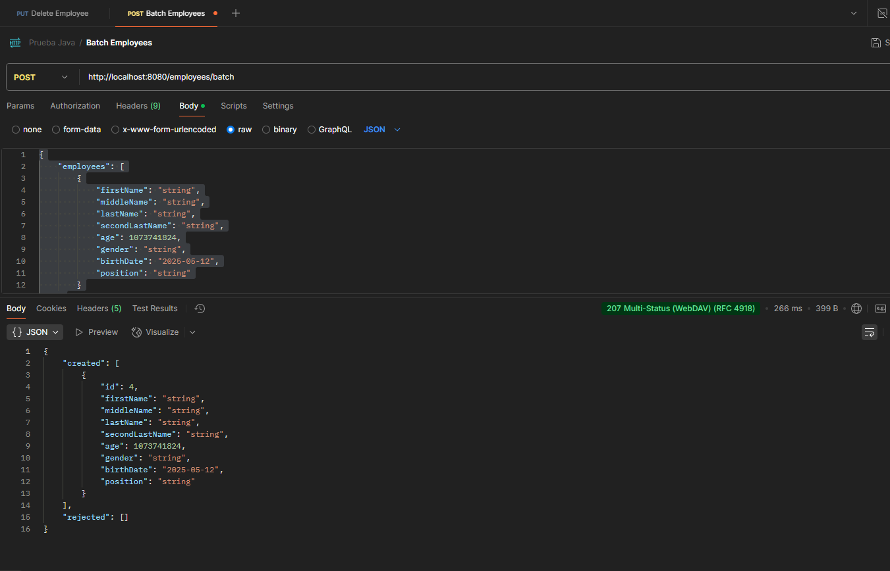

# Employee Service

Servicio REST para la gestión de empleados. Implementado en Java con Spring Boot, siguiendo los principios de Clean Architecture.

---

## 🧱 Arquitectura

El proyecto está organizado en capas siguiendo **Clean Architecture**:

com.prueba.tecnica.employeeservice

- `application`: Casos de uso (orquestación de lógica de negocio)
- `domain`: Entidades, interfaces, reglas de negocio y errores de dominio
- `infrastructure`: Implementaciones técnicas (JPA, mapeadores, persistencia)
- `presentation`: Controladores REST, DTOs, middlewares de errores

---

## 🚀 Tecnologías

- Java 17
- Spring Boot 3.5.0-SNAPSHOT
- Spring Data JPA
- PostgreSQL
- Lombok
- Swagger OpenAPI 3 (springdoc-openapi-starter 2.3.0)
- JUnit 5 + Mockito
- Maven

---

## 📦 Instalación y ejecución

```bash
# 1. Clonar repositorio
git clone https://github.com/jesusamador-dev/prueba-java
cd prueba-java
```

---
## 📮 Postman

Para facilitar las pruebas del servicio, se incluye una **colección de Postman** con todos los endpoints de `EmployeeService`.

### 🧪 Endpoints incluidos

- `POST /employees` – Crear un empleado
- `POST /employees/batch` – Crear empleados en lote
- `GET /employees` – Listar todos los empleados
- `PUT /employees/{id}` – Actualizar un empleado por ID
- `DELETE /employees/{id}` – Eliminar un empleado por ID

### 📥 Importar la colección

1. Abre **Postman**
2. Haz clic en `Import > File`
3. Selecciona el archivo: /prueba-java/docs/PruebaJava.postman_collection.json

### Evidencias

#### 1. Batch


#### 2. Create

